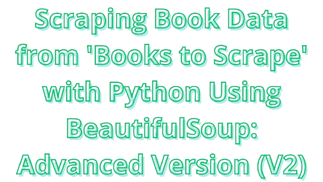

# 📚 Books to Scrape - Scraping Using BeautifulSoup: Advanced Version (V2)

<div align="center">
   
</div>

[](LICENSE) [](https://www.python.org/) [](https://jupyter.org/)

This Python script is an advanced version of the Books to Scrape scraper. It extends the basic functionality of scraping book data from the [Books to Scrape](https://books.toscrape.com/) website by adding more features, including category-wise image downloads, multiple-page scraping, and handling of additional metadata like product descriptions and pricing details. The scraper collects extensive details about books, such as titles, prices, ratings, availability, descriptions, and cover image URLs. It then saves the data into a CSV file and downloads the images into categorized folders.

## ✨ Features

- 📖 Scrapes book, such as titles, price (including and excluding tax), ratings, availability, Product Description, and cover image URLs from the site [Books to Scrape](https://books.toscrape.com/).
- 📂 Supports scraping multiple pages across different book categories, making it easier to collect large datasets from the site.
- 🖼️ Downloads images: The scraper saves book cover images into specific folders categorized by the book's genre.
- 📊Saves data into a CSV file: All scraped data is saved in `books_data.csv` with columns for title, price, description, availability, and more.
- 📚 Category-wise scraping: Scrapes book links and image URLs by category, and even follows pagination to ensure all books are captured.

## 🛠️ Technologies Used

### 🔹 WebImageScraping.py – Category, Link, & Image Scraping

[](https://docs.python-requests.org/)
[](https://www.crummy.com/software/BeautifulSoup/)
[](https://pypi.org/project/wget/)
[](https://docs.python.org/3/library/os.html)
[](https://docs.python.org/3/library/re.html)
[](https://docs.python.org/3/library/pathlib.html)

### 🔹 WebDataScraping.py – Book Detail Extraction & CSV Export

[](https://docs.python-requests.org/)
[](https://www.crummy.com/software/BeautifulSoup/)
[](https://docs.python.org/3/library/csv.html)
[](https://docs.python.org/3/library/time.html)

## ⚙️ Installation

1. 📥 Clone the repository:

   ```bash
   git clone https://github.com/RyanGA09/books-to-scrape-scraping-beautifulsoup-v2.git
   ```

2. 📁 Navigate to the project directory:

   ```bash
   cd books-to-scrape-scraping-beautifulsoup-v2
   ```

3. 🐍 Create a virtual environment:

   ```bash
   python3 -m venv venv
   ```

4. ▶️ Activate Virtual Environment:

   - On Linux/MacOS:

   ```bash
   source venv/bin/activate # On Linux
   ```

   - On Windows:

     ```bash
     venv\Scripts\activate # On Windows
     ```

5. 📦 Install the required dependencies:

   ```bash
   pip install -r requirements.txt
   ```

## 🚀 Usage

You can run the scraper using the Python script or interactively via Jupyter Notebook. The script will scrape book data, save it to a CSV file, and download images to the local machine.

Run the script to start scraping:

1. ▶️ On Python:

   - 🖼️ Scraping Image

     ```bash
      python WebImageScraping.py
     ```

   - 📄 Scraping Data

     ```bash
      python WebDataScraping.py
     ```

2. 💻 On Notebook:

   1. Start Jupyter Notebook:

      ```bash
      jupyter notebook
      ```

   2. Open `WebScrapingExperiment.ipynb` in the Jupyter interface and run the cells sequentially.

      This notebook allows for interactive scraping and image downloading.

      **💡 Note:**

      If you are developing using Visual Studio Code (VSCode), PyCharm, or any other external IDE, you don't have to run the _jupyter notebook_ command. Simply open the notebook file (`WebScrapingExperiment.ipynb`) directly inside your IDE, then run the code directly from there without the need to open Jupyter Notebook through a browser.

## 🧠 How It Works

### WebImageScraping.py

1. 🔎 Category Scraping:

   - The script starts by scraping all book categories available on the homepage. It follows each category's link and scrapes books from each category, including handling pagination.

2. 🖼️ Book Links & Image Scraping:

   - For each category, the script collects book links and image URLs using the `scrape_links_of_books_in_category()` function.
   - The function `save_image()` then downloads the book cover images into folders structured by category.

3. 📝 Book Data Scraping
   - The script also collects metadata for each book (such as title, price, description, etc.) by scraping individual book pages using the function `scrape_books_from_category_page()`.

### WebScraping.py

1. 📘 Book Details:

   - For each book, the script scrapes detailed information including pricing (both pre-tax and post-tax), product description, title, image URL, and availability using the function `scrape_book_details()`.

2. 💾 Saving Data:

   - The script aggregates the data for all books and saves it into a CSV file (`books_data.csv`) using the `save_to_csv()`. function.

   **📂 Note:**

   Images will be saved into folders organized by book category (e.g., `images/category/Science/`). If a category folder doesn't exist, it will be created automatically.

## 🔄 Explanation Changes and Improvements in Version 2 (Advanced Version)

- 📁 Image Downloading by Category: Images are now saved in dedicated folders categorized by book genre (e.g., `images/category/Science/`).
- 📄 Pagination Support: The scraper handles multiple pages within categories to ensure all books are captured.
- 🧾 Detailed Metadata: Additional book information such as pricing (including and excluding tax) and product descriptions are scraped.
- 📈 Flexible Data Saving: Data is stored in a CSV file with all relevant details, making it easier to analyze and process.

## 📰 Read More

Check out my article on [Medium](https://medium.com/@ryangadingabdullah/):

[](https://medium.com/@ryangadingabdullah/scraping-book-data-from-books-to-scrape-with-python-using-beautifulsoup-advanced-version-v2-dc7d59b8634e)

## ☕ Support Me

This is a non-commercial project. If you find it useful and would like to support the development of this project, you can donate via the links below. Your support helps improve the project, but it does not grant any commercial rights over the project itself.

[](https://saweria.co/RyanGA09)

<!-- [](https://www.paypal.me/ryangading) -->

## 📜 License

This project is licensed under the `MIT License`. It is for **personal, academic, and non-commercial use only**. Any commercial use is prohibited without explicit written permission from the author.

See the [LICENSE](LICENSE) file for more details.

Copyright &copy; 2024 Ryan Gading Abdullah. All rights reserved.

## 📧 Contact

For commercial inquiries, please contact:

[](mailto:ryangadinga90@gmail.com)

Or reach me on LinkedIn:

[](https://www.linkedin.com/in/ryan-gading-abdullah/)
